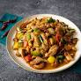

# Cashew Chicken
### Wok-Fried Version (as opposed to deep-fried)
https://hot-thai-kitchen.com/cashew-chicken/

A fairly simple version of a classic recipe that *sears* the chicken on high heat as opposed to breading it and frying in oil.
Advantages include:
- Less oil used
- No breading to get soggy with the sauce
- Chicken has the opportunity to sear
- Less likely to set off **fire alarms**

